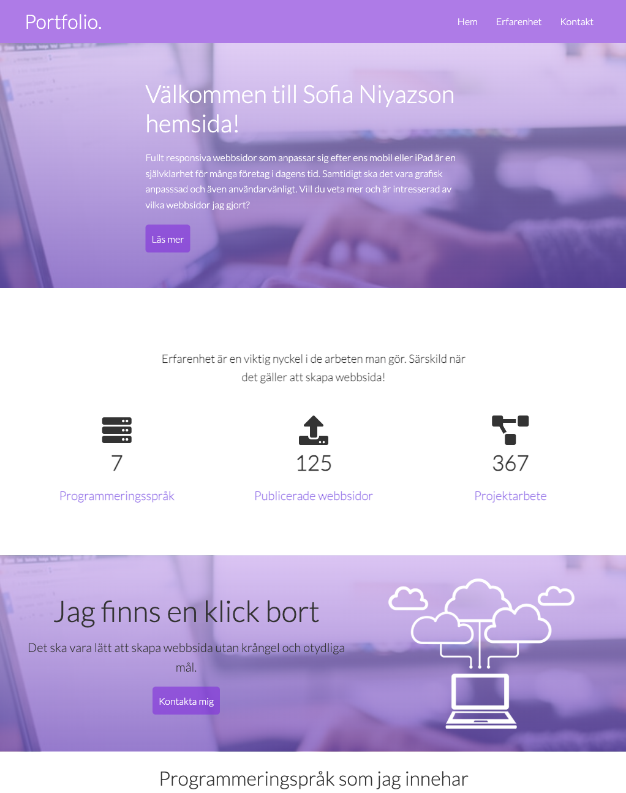
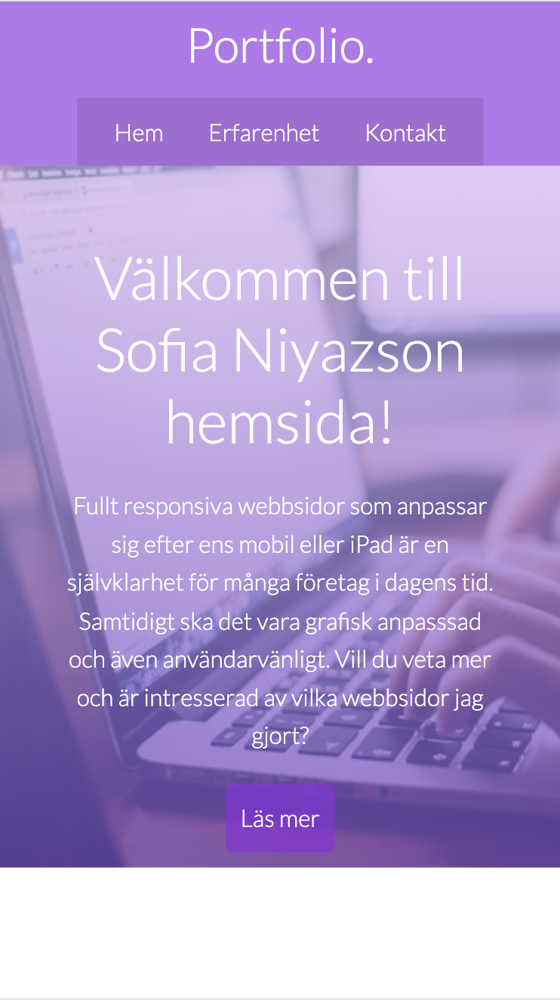

# 🌟 Mitt Portfolio

> En modern och responsiv portfolio byggd med HTML, CSS och JavaScript.

🔗 **Live Demo:** [https://mittportfolio.netlify.app](https://mittportfolio.netlify.app)

---

## 💡 Om projektet
Detta är mitt personliga portfolio där jag visar upp mina webbprojekt, designidéer och kontaktinformation.  
Målet var att skapa en **ren och professionell design** som fungerar bra på både mobil och desktop.

---

## 🧰 Tekniker som använts
- HTML5  
- CSS3 (Flexbox, Grid, Animationer)  
- JavaScript (interaktivitet och menyhantering)  
- Git & GitHub  

---

## 📱 Responsiv design
Portfolion är helt responsiv och anpassad för:

- 📱 **Mobil** (375 px (Devtools iPhone SE)
- 💻 **Surfplatta** (768 px (DevTools iPad Mini)
- 🖥️ **Desktop** (1024 px (Devtools iPad Pro)

---

## 🧠 Lärdomar
Jag lärde mig att:

- Strukturera CSS med variabler och moduler  
- Arbeta med media queries  
- Använda GitHub Pages för att publicera projektet

## 📸 Skärmbilder
### Startsida


### Mobile-first


---

## 🧰 Tekniker som använts

### 🧱 HTML
- Använt för att skapa en tydlig **semantisk struktur** med element som `<header>`, `<main>` och `<footer>`.
- Fokus på **tillgänglighet** och korrekt hierarki för rubriker.

### 🎨 CSS
- Ansvarar för **layout, färg och typografi**.
- Använder **Flexbox** och **CSS Grid** för att bygga en responsiv design som fungerar på både mobil, surfplatta och desktop.
- Inkluderar **animationer** och **hovereffekter** för att ge en mer dynamisk upplevelse.

### ⚡ JavaScript
- Använt för **interaktivitet och dynamiska funktioner**.
- Skrivet med **moderna ES6-funktioner** (arrow functions, let/const, template literals).
- Hanterar användarhändelser som klick på knappar, formulär eller navigation.

---

## 🖱️ Interaktiva funktioner

I min portfolio finns flera funktioner som förbättrar användarupplevelsen:

- 🔄 **Responsiv navigationsmeny** som öppnas/stängs med JavaScript på mobila enheter.  
- 💬 **Kontaktformulär** med enkel validering för att säkerställa att användaren fyller i rätt uppgifter.  
- 🎞️ **Små animationer och övergångar** för att göra sidan mer levande.  
- 🌗 (Eventuellt) **Dark mode/light mode-växling** för bättre tillgänglighet.

När man använder dessa funktioner uppdateras innehållet dynamiskt, utan att sidan behöver laddas om.

---

## 🚧 Utmaningar & lösningar

### 🧩 Utmaning:
Att få **layouten att fungera på alla skärmstorlekar** (mobil, surfplatta, desktop) och samtidigt behålla en snygg design.

**💡 Lösning:**
Jag använde **media queries** tillsammans med **flex och grid** för att justera elementens storlek och position beroende på skärmens bredd.

---

### 🧩 Utmaning:
Att implementera **interaktiva funktioner** utan att koden blev för rörig.

**💡 Lösning:**
Jag organiserade JavaScript i tydliga block, använde **ES6-funktioner** och kommenterade koden för bättre läsbarhet.

---

### 🧩 Utmaning:
Att publicera projektet och få allt att fungera på nätet.

**💡 Lösning:**
Jag använde **GitHub Pages** för att hosta portfolion, och kontrollerade att alla relativa sökvägar (CSS, JS, bilder) fungerade korrekt online.

---


## 🚀 Installation
Om du vill köra projektet lokalt:

```bash
# Klona repot
git clone https://github.com/sofianiyazson/examination

# Öppna mappen
cd portfolio

# Öppna i webbläsaren
open index.html